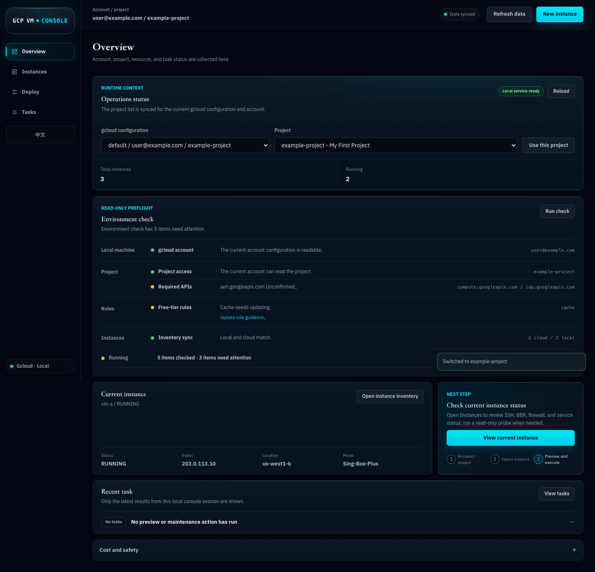
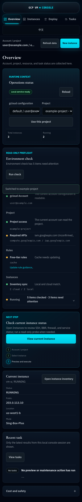

# GCP VM Console

_Local, safety-first Google Cloud VM operations workbench._

[简体中文](README.zh-CN.md) · English

A local, safety-first workbench for Google Cloud Compute Engine. It uses the
installed `gcloud` CLI as the only cloud control path and keeps credentials,
records, task history, and secrets on the user's machine.

The project is designed for people who need a clear workflow around VM
inventory, diagnostics, deployment previews, SSH, firewall exposure, and
maintenance without turning a local tool into a hosted control plane.

## What it provides

- Account and project selection without changing the user's global gcloud context.
- Cloud VM inventory with scoped local records and bounded cache fallback.
- Read-only diagnosis for SSH, BBR, services, firewall exposure, and deployment recognition.
- Fingerprinted deployment previews that must still match live state before execution.
- Explicit confirmation and per-instance task locks for cloud writes.
- Local task history with interrupted-task recovery and no automatic resume.
- SSH dual-entry and network-exposure governance with fail-closed validation.
- Optional deployment adapters for Sing-Box-Plus, 3X-UI, and custom startup scripts.
- Built-in English / Simplified Chinese interface switching with a locally persisted preference; cloud identifiers and command literals remain unchanged.

The adapters are optional and should only be used on infrastructure you own or
are authorized to administer.

## Preview

These previews use mock data from the responsive layout audit; they do not show
a real account, project, VM, IP address, or node link.



[简体中文桌面预览](docs/demo/workbench-zh-CN-1440.png)



[简体中文移动端预览](docs/demo/workbench-zh-CN-390.png)

## Safety model

- The console never ships a cloud credential or a private key.
- Runtime state lives outside version control under `.gcp-vm-console/`.
- Read-only flows and cloud-write flows are separated in the server and UI.
- Cloud writes require a current preview, a matching fingerprint, a task lock,
  and explicit user confirmation.
- There is no cloud-delete endpoint.
- The local API is an unauthenticated loopback service; do not expose port 8787
  beyond the local machine. Browser requests from non-loopback origins are
  rejected, but this is not a replacement for network access control.
- SSH passwords are stored only in a local restricted Secret Store and are not
  written to records, logs, command arguments, or cloud metadata.
- Live acceptance checks must target infrastructure that the operator owns or
  is authorized to review.

Read [SECURITY.md](SECURITY.md) before connecting the console to a project.

Custom startup scripts are copied into Compute Engine instance metadata and run
as `root` on every Linux VM boot. Keep them idempotent, exclude secrets, and
check the guest-agent logs after creation; the console does not verify script
success or open ports required by the script.

## Requirements

- Node.js 20 or newer
- npm
- Google Cloud SDK (`gcloud`)
- A gcloud configuration with access to the Compute Engine projects you intend
  to manage
- A macOS/Linux shell with `bash`, `lsof`, and `curl` for the helper scripts

The console does not create an account, log in to Google Cloud, or upload local
records to a remote service.

## Quick start

Authenticate and prepare a dedicated local configuration before opening the
console (replace the placeholders with your own values):

```bash
gcloud auth login
gcloud config configurations create gvc-local --no-activate
gcloud config set account YOUR_ACCOUNT --configuration=gvc-local
gcloud config set project YOUR_PROJECT_ID --configuration=gvc-local
./scripts/start-ui.sh
```

The console lists every available gcloud configuration and account. It does
not change the global active configuration when you switch projects in the UI.

## Run locally

```bash
./scripts/start-ui.sh
```

Open <http://127.0.0.1:8787>. Stop the local server with:

```bash
./scripts/stop-ui.sh
```

On first use, the console reads available configurations and projects and
applies the first valid selection for the initial read-only sync; you can
switch context from Overview before any write. Do not copy real credentials,
project IDs, IP addresses, or private-key paths into source files or issues.

## Verify changes

Install dependencies and run the full local gate:

```bash
npm --prefix ui ci
npm --prefix ui run check
```

The check command validates JavaScript and shell syntax and runs the unit and
contract suite. Browser layout and performance audits are available locally
when a Playwright browser is installed:

```bash
npm --prefix ui run audit:layout
npm --prefix ui run audit:i18n
npm --prefix ui run audit:context
npm --prefix ui run audit:performance:browser
```

Tests use mock data and do not create, stop, restart, delete, or modify real
cloud resources.

## Project layout

```text
ui/server/       gcloud runner, safety policy, services, persistence
ui/public/       browser UI and pure view models
ui/test/         unit, contract, safety, and layout tests
scripts/         local start/stop helpers
docs/            architecture and public safety contracts
```

Public documentation language pairs are listed in
[`docs/DOCUMENTATION_SYNC.md`](docs/DOCUMENTATION_SYNC.md).

## License

The original project source is released under the MIT License. Dependencies
retain their own licenses; see [THIRD_PARTY_NOTICES.md](THIRD_PARTY_NOTICES.md).

## Contributing

Bug reports and pull requests are welcome. Please use mock data in tests,
redact infrastructure identifiers, and do not submit credentials or live node
links. See [CONTRIBUTING.md](CONTRIBUTING.md).
