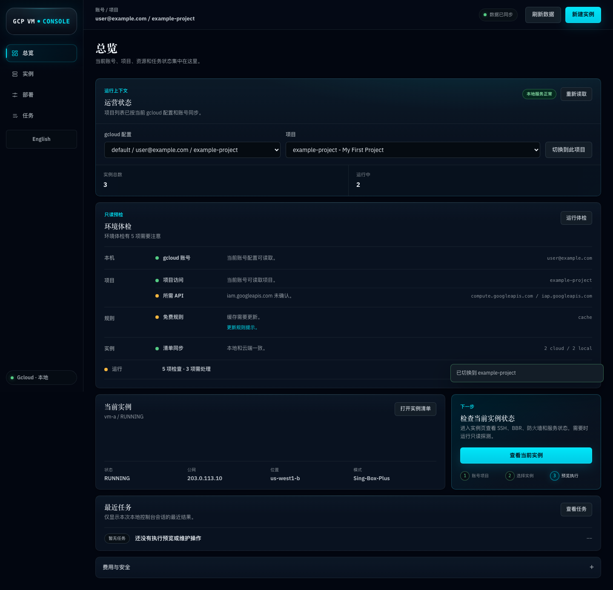
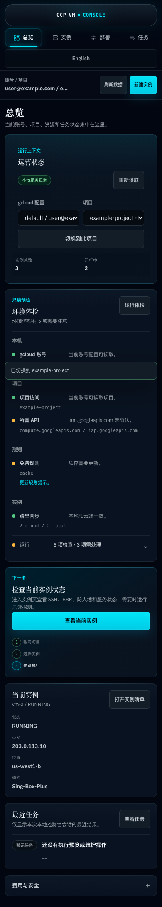

# gcloud-vm-console

[English](README.md) · 简体中文

一个本地运行、以安全为先的 Google Cloud Compute Engine 控制台。项目只通过已安装的 `gcloud` CLI 操作云端，并将凭据、记录、任务历史和密钥留在用户自己的机器上。

它面向需要管理虚拟机清单、诊断、部署预览、SSH、防火墙暴露和维护流程的用户，避免把本地工具变成托管式控制平面。

## 功能概览

- 选择账号和项目，不修改用户全局的 gcloud 上下文。
- 查看云端 VM 清单，并提供受范围限制的本地记录和缓存回退。
- 对 SSH、BBR、服务、防火墙暴露和部署方式执行只读诊断。
- 使用指纹化部署预览；执行前仍必须与实时状态匹配。
- 云端写操作需要明确确认，并按实例加任务锁。
- 保存本地任务历史；中断任务需要人工恢复，不会自动续跑。
- 提供 SSH 双入口和网络暴露治理，并采用失败关闭的校验策略。
- 提供可选的 Sing-Box-Plus、3X-UI 和自定义启动脚本适配器。
- 内置 English / 简体中文界面切换，并在本地保存语言偏好；云端标识符和命令字面量保持不变。

适配器只应在你拥有或获授权管理的基础设施上使用。

## 预览

以下预览来自响应式布局审计的 mock 数据，不包含真实账号、项目、VM、IP 地址或节点链接。



[English desktop preview](docs/demo/workbench-en-US-1440.png)



[English mobile preview](docs/demo/workbench-en-US-390.png)

## 安全模型

- 项目不会携带云端凭据或私钥。
- 运行时状态位于版本控制之外的 `.gcp-vm-console/`。
- 只读流程与云端写流程在服务端和界面中分离。
- 云端写操作必须满足：当前预览有效、指纹匹配、任务锁可用，并且用户明确确认。
- 项目没有云端删除接口。
- SSH 密码只保存在本地受限 Secret Store 中，不写入记录、日志、命令参数或云端元数据。
- 实时验收只能针对操作者拥有或获授权检查的基础设施。

连接任何项目之前，请先阅读 [安全政策](SECURITY.zh-CN.md)。

## 环境要求

- Node.js 20 或更高版本
- npm
- Google Cloud SDK（`gcloud`）
- 一个拥有目标 Compute Engine 项目访问权限的 gcloud 配置

项目不会创建账号、登录 Google Cloud，也不会把本地记录上传到远程服务。

## 本地运行

```bash
./scripts/start-ui.sh
```

打开 <http://127.0.0.1:8787>。停止本地服务：

```bash
./scripts/stop-ui.sh
```

首次使用时，控制台会读取可用的 gcloud 配置和项目，并将第一个有效选择用于初次只读同步；任何写操作前都可以在“总览”中切换上下文。不要把真实凭据、项目 ID、IP 地址或私钥路径复制到源代码或 issue 中。

## 验证改动

安装依赖并运行完整本地检查：

```bash
npm --prefix ui ci
npm --prefix ui run check
```

检查命令会验证 JavaScript 和 shell 语法，并运行单元测试与契约测试。安装了 Playwright 浏览器后，还可以运行浏览器布局和性能审计：

```bash
npm --prefix ui run audit:layout
npm --prefix ui run audit:performance:browser
```

测试使用 mock 数据，不会创建、停止、重启、删除或修改真实云资源。

## 项目结构

```text
ui/server/       gcloud runner、安全策略、服务和持久化
ui/public/       浏览器界面和纯 view model
ui/test/         单元、契约、安全和布局测试
scripts/         本地启动/停止脚本
docs/            架构和公开安全契约
```

公开文档的中英文配对规则见
[文档语言同步说明](docs/DOCUMENTATION_SYNC.md)。

## 许可证

项目源代码采用 MIT License。依赖保留各自许可证，详见[第三方声明](THIRD_PARTY_NOTICES.zh-CN.md)。

## 贡献

欢迎提交 bug 报告和 pull request。测试请使用 mock 数据，基础设施标识必须脱敏，不要提交凭据或真实节点链接。详见[贡献指南](CONTRIBUTING.zh-CN.md)。
